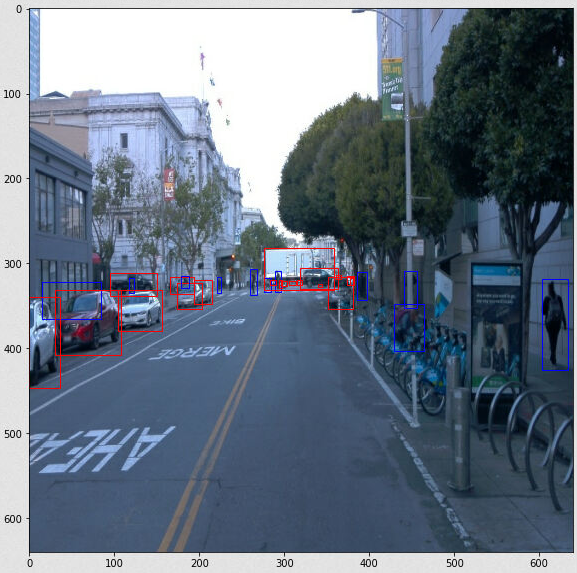
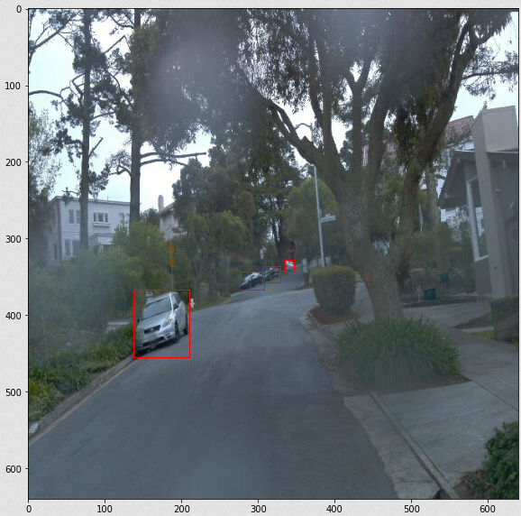
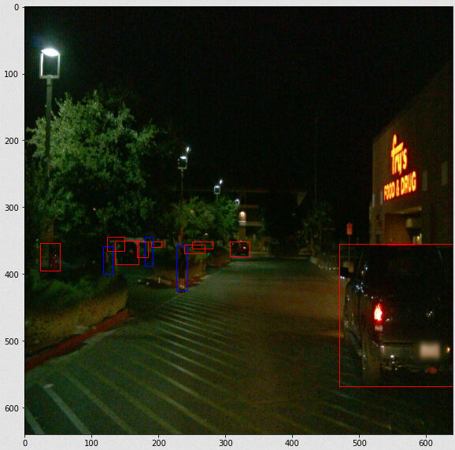
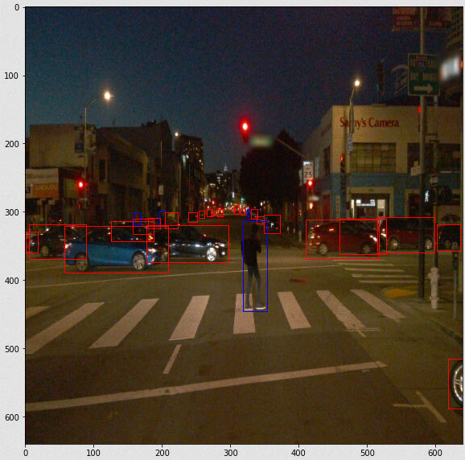
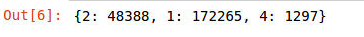
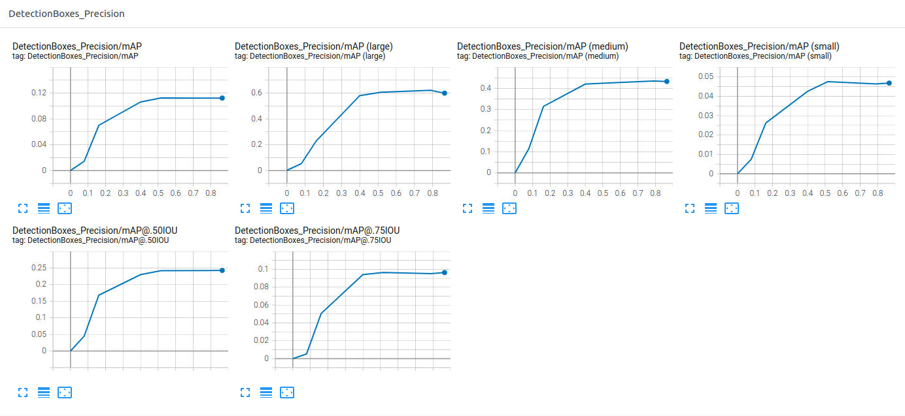
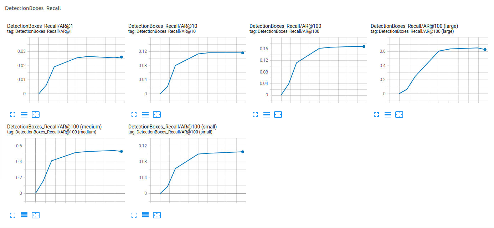
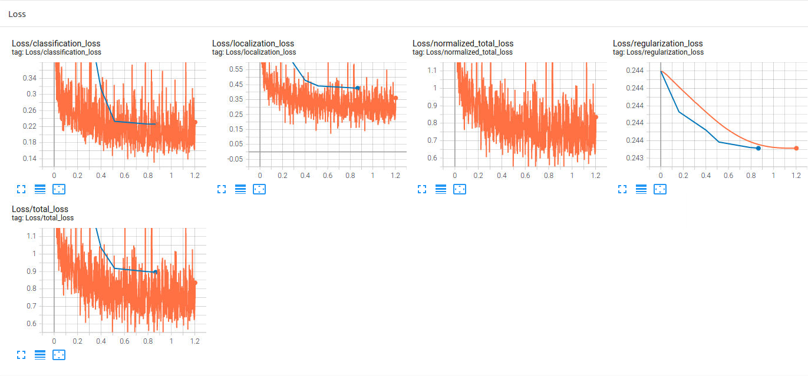
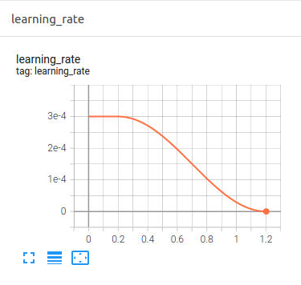

# Udacity---Object-Detection-in-an-Urban-Environment

## Data

For this project, we will be using data from the [Waymo Open dataset](https://waymo.com/open/).

[OPTIONAL] - The files can be downloaded directly from the website as tar files or from the [Google Cloud Bucket](https://console.cloud.google.com/storage/browser/waymo_open_dataset_v_1_2_0_individual_files/) as individual tf records. We have already provided the data required to finish this project in the workspace, so you don't need to download it separately.

## Structure

### Data

The data you will use for training, validation and testing is organized as follow:
```
/home/workspace/data/waymo
	- training_and_validation - contains 97 files to train and validate your models
    - train: contain the train data (empty to start)
    - val: contain the val data (empty to start)
    - test - contains 3 files to test your model and create inference videos
```
The `training_and_validation` folder contains file that have been downsampled: we have selected one every 10 frames from 10 fps videos. The `testing` folder contains frames from the 10 fps video without downsampling.
```
You will split this `training_and_validation` data into `train`, and `val` sets by completing and executing the `create_splits.py` file.
```

## Prerequisites

### Local Setup

For local setup if you have your own Nvidia GPU, you can use the provided Dockerfile and requirements in the [build directory](./build).

Follow [the README therein](./build/README.md) to create a docker container and install all prerequisites.

### Download and process the data

**Note:** ”If you are using the classroom workspace, we have already completed the steps in the section for you. You can find the downloaded and processed files within the `/home/workspace/data/preprocessed_data/` directory. Check this out then proceed to the **Exploratory Data Analysis** part.

The first goal of this project is to download the data from the Waymo's Google Cloud bucket to your local machine. For this project, we only need a subset of the data provided (for example, we do not need to use the Lidar data). Therefore, we are going to download and trim immediately each file. In `download_process.py`, you can view the `create_tf_example` function, which will perform this processing. This function takes the components of a Waymo Tf record and saves them in the Tf Object Detection api format. An example of such function is described [here](https://tensorflow-object-detection-api-tutorial.readthedocs.io/en/latest/training.html#create-tensorflow-records). We are already providing the `label_map.pbtxt` file.

You can run the script using the following command:
```
python download_process.py --data_dir {processed_file_location} --size {number of files you want to download}
```

You are downloading 100 files (unless you changed the `size` parameter) so be patient! Once the script is done, you can look inside your `data_dir` folder to see if the files have been downloaded and processed correctly.

## The Goal
This project is to use the SSD-ResNet-50 to train the model (consider as transfer learning) to detect and localize the vehicle, pedestrian and cyclist in urban environment. At the same time, it is needed to make the adjustment in the hyperparameters to make the model detect the objects well.

## Initial Workflow
At first, I try to setup in my own workspace by downloading the dataset by using the 'download_process.py' script. If using the script, the dataset will be downloaded, processed and saved in processed file. After that, by using the 'create_splits.py' script, I have made the code for splitting the dataset to ratio of 8:1:1 (training, testing and validating). However, due to the difficulty of environement setup, I cannot continue with EDA. Hence, I choose to use back the provided workspace. In the provided workspace, the data has been splitted well, therefore, it can be used directly with the EDA. In EDA, the project needs us to observe the characteristics of the dataset. 

## Dataset Observation
Here are some of results of annotation on the every objects based on the groundtruth bounding boxes provided in tfrecord file. The attached results show that the dataset consists of several environment such as sunnny/cloudy weather, day/night time. With the observation, it is noted that number of vehicles is the most all of the time in the dataset. 









## Analysis
### EDA
A simple analysis is done based on the training dataset. The aim is to find out how frequent the car, pedestrian and cyclist shown suring training. In this time, I take 10,000 images randomly from the dataset to find it out. Below shows the result that I found in which the cars are the most frequent, followed by the pedestrian and lastly cyclist. 



### Suitable Augmentation
In this project, it is given the instruction that by using the augmentation may increase the accuracy of model. Therefore, from the previous analysis, I have chosen the following augmentations:
1. random_horizontal_flip
2. random_crop_image
3. random_adjust_brightness
4. random_adjust_contrast
5. random_adjust saturation
6. random_distort_color
7. random_adjust_hue

## Edit the config file

Now you are ready for training. As we explain during the course, the Tf Object Detection API relies on **config files**. The config that we will use for this project is `pipeline.config`, which is the config for a SSD Resnet 50 640x640 model. You can learn more about the Single Shot Detector [here](https://arxiv.org/pdf/1512.02325.pdf).

First, let's download the [pretrained model](http://download.tensorflow.org/models/object_detection/tf2/20200711/ssd_resnet50_v1_fpn_640x640_coco17_tpu-8.tar.gz) and move it to `/home/workspace/experiments/pretrained_model/`.

We need to edit the config files to change the location of the training and validation files, as well as the location of the label_map file, pretrained weights. We also need to adjust the batch size. To do so, run the following:
```
python edit_config.py --train_dir /home/workspace/data/train/ --eval_dir /home/workspace/data/val/ --batch_size 2 --checkpoint /home/workspace/experiments/pretrained_model/ssd_resnet50_v1_fpn_640x640_coco17_tpu-8/checkpoint/ckpt-0 --label_map /home/workspace/experiments/label_map.pbtxt
```
A new config file has been created, `pipeline_new.config`.

## Training
A several experiment have been carried out and this is so far the best result can be obtained. By using the SGD optimizer with its default momentum and the decay learning rate of 3e-4, the training is carried out together with the mentioned augmentations and 3000 of total steps. The reason of using 3000 of total steps is because it would lead to overfitting and delete the previous batch weights are needed(based on the experiment of 5000). From the figure, it shows that the validation loss and mAP haven't reached plateau, however, it is near to each other. 









### Creating an animation
#### Export the trained model
Modify the arguments of the following function to adjust it to your models:

```
python experiments/exporter_main_v2.py --input_type image_tensor --pipeline_config_path experiments/reference/pipeline_new.config --trained_checkpoint_dir experiments/reference/ --output_directory experiments/reference/exported/
```

This should create a new folder `experiments/reference/exported/saved_model`. You can read more about the Tensorflow SavedModel format [here](https://www.tensorflow.org/guide/saved_model).

Finally, you can create a video of your model's inferences for any tf record file. To do so, run the following command (modify it to your files):
```
python inference_video.py --labelmap_path label_map.pbtxt --model_path experiments/reference/exported/saved_model --tf_record_path /data/waymo/testing/segment-12200383401366682847_2552_140_2572_140_with_camera_labels.tfrecord --config_path experiments/reference/pipeline_new.config --output_path animation.gif
```

## Animation Result


## Future Work
This project still has the improvement such as adjusting the hyperparameters of training to increase the accuracy on the object detection and the performance of validation loss with mAP. Also, from the animation, the calculation of accuracy has duplicated sometimes, maybe it is because of the miscalculation of the default non-max suppression function. Due to the submission date required and the limited hardware resources, this project can be done to here so far. 